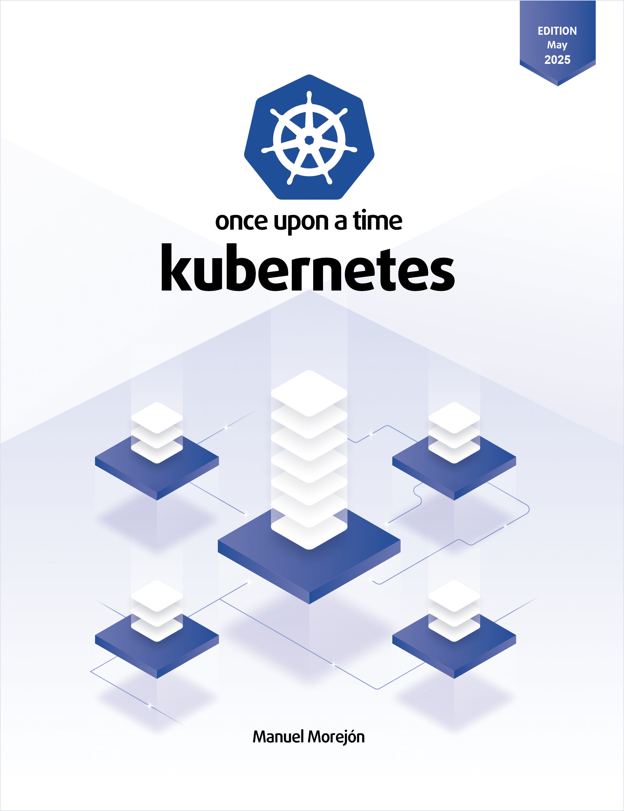

# 🏰 Once Upon a Time Kubernetes

<div align="center">



### The official source code to master Kubernetes v1.32+

**This repository contains the practical labs from the book.**
Here you have the *"what"* (YAML manifests and scripts), but to understand the *"why"* (architecture, design, and DevOps strategy), you need the complete guide.

👇 **Get the updated 2025 edition here:** 👇

[](https://www.amazon.es/dp/B0FB44MDQ7)
[](https://leanpub.com/once-upon-a-time-kubernetes)

</div>

---

## ⚡ Project Status

> **2025 Update:** This repository is kept strictly up to date. We have migrated the lab environment from **Vagrant** to **Kind**. Now you can spin up a professional cluster on your laptop in less than 2 minutes, consuming less RAM and aligned with modern standards.

| Branch | Distribution | Status |
| :--- | :--- | :--- |
| **`main` / `v2.x`** | **Kind (K8s v1.32)** | ✅ **Recommended (Current Book)** |
| `v1.x` | VirtualBox + Vagrant | ⚠️ Legacy (Previous Editions) |

---

## 🛠️ Prerequisites

To run the examples without errors, ensure you have the following tools installed:

* **Docker** `>= 27.2.0`
* **Kubectl** `>= 1.35.0`
* **Kind** `>= v0.30.0` (Kubernetes in Docker)

---

## 🚀 What will you deploy?

This code accompanies the book chapters, where you will learn to:
- **Chapter 2:** Spin up a multi-layer K8s cluster locally (no cloud costs).
- **Chapter 9:** Ingress strategies to expose your apps to the real world.
- **Chapter 12:** Manage persistent storage (PVCs) without data loss.

*Stuck on an exercise? The step-by-step explanation is in the corresponding chapter of the book.*

---

## 🚀 How to start (Quickstart)

Follow these steps to get your lab ready as described in **Chapter 2** of the book.

### 1. Clone the repository
```bash
git clone https://github.com/mmorejon/once-upon-a-time-k8s.git
cd once-upon-a-time-k8s
```

### 2. Create the cluster
We have automated the cluster creation. Detailed configurations can be found in `cluster/kind-config.yaml`.

```bash
# Run the creation script from the project root
bash/cluster.sh create
```

### 3. Expected Result
If everything went well, you will see the initialization of the nodes and the control plane:

```text
Creating cluster "book" ...
 ✓ Ensuring node image (kindest/node:v1.35.0) 🖼
 ✓ Preparing nodes 📦 📦 📦
 ✓ Writing configuration 📜
 ✓ Starting control-plane 🕹️
 ✓ Installing CNI 🔌
 ✓ Installing StorageClass 💾
 ✓ Joining worker nodes 🚜
Set kubectl context to "kind-book"
```

Ready! Your `kubectl` context now points to the `kind-book` cluster. You can now start deploying.

```bash
kubectl cluster-info --context kind-book
```

---

## 🤝 Community and Feedback

This project is alive thanks to the readers. Since Leanpub doesn't have a native comments system, we use this repository to centralize the communication.

**What do you want to do today?**

| Your goal | Where to go |
| :--- | :--- |
| 📣 **Leave a review** | [**Go to Discussions / Reviews and Feedback**](https://github.com/mmorejon/once-upon-a-time-k8s/discussions/categories/reviews-and-feedback) <br> *Tell us what you think of the book.* |
| 💬 **I have a question** | [**Go to Discussions / Q&A**](https://github.com/mmorejon/once-upon-a-time-k8s/discussions/categories/q-a-questions-and-help) <br> *Ask about concepts, diagrams or exercises.* |
| 💡 **Suggest ideas** | [**Go to Discussions / Ideas**](https://github.com/mmorejon/once-upon-a-time-k8s/discussions/categories/ideas-for-future-editions) <br> *Propose topics for future chapters.* |
| 🐛 **Report an error** | [**Open an Issue**](https://github.com/mmorejon/once-upon-a-time-k8s/issues/new) <br> *Only for typos or errors in the code.* |

---

## 🤝 Community and Support

This project is alive thanks to the readers.

1.  ⭐ **Found it useful?** Give the repository a **star** (top right). It helps us reach more engineers.
2.  📚 **Don't have the book yet?**

<div align="center">
    <a href="https://www.amazon.es/dp/B0FB44MDQ7">
        
    </a>
</div>
